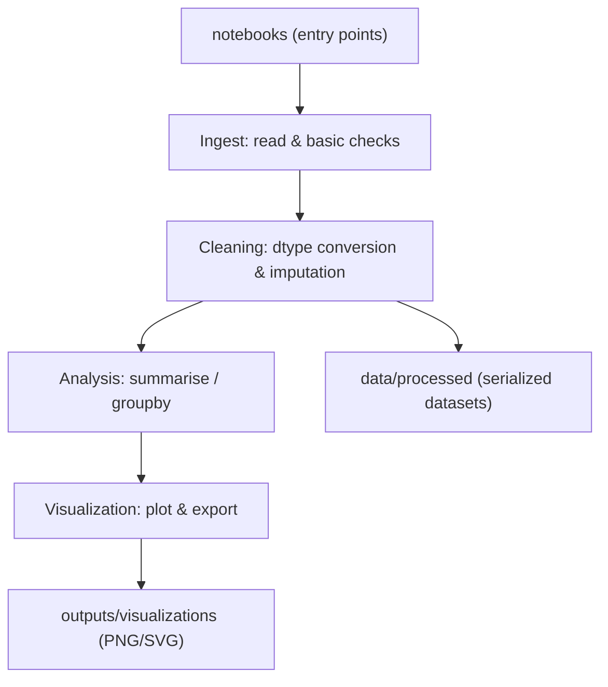

# data-analysis-basics — Foundational data analysis artifacts


Short summary
-------------
A collection of structured, reproducible notebooks and exported artifacts that demonstrate practical patterns for data ingestion, preprocessing, exploratory analysis (EDA), and visualization using Python, NumPy, and Pandas. Materials are presented as implementation-focused notebooks and serialized artifacts for reference and reuse.

Execution summary
-----------------
- Scope: reproducible patterns for ingestion, cleaning, analysis, and visualization
- Primary technologies: Python, NumPy, Pandas, Matplotlib/Seaborn
- Deliverables: notebooks/, data/processed/, outputs/visualizations/
- Focus: clarity of data flow, reproducible workflows, and basic checks applied during preprocessing

Why this matters
----------------
- Provides reference implementations for common data-preparation and EDA patterns.
- Demonstrates vectorized and memory-aware approaches where applicable.
- Produces exportable visual artifacts suitable for inclusion in reports or documentation.
- Emphasizes explicit data lineage and clear processing steps rather than automated guarantees.

Repository contents (highlight)
--------------------------------
- notebooks/ — executable Jupyter notebooks that implement analysis workflows
- data/processed/ — cleaned and serialized datasets consumed by the notebooks
- outputs/visualizations/ — exported figures and plot artifacts (PNG/SVG)

Representative notebook themes
------------------------------
Typical notebooks cover themes such as data ingestion and basic checks, dtype management and cleaning strategies, exploratory data analysis and group summaries, and visualization and figure export. Files and naming vary; expect goal-oriented notebooks that demonstrate these themes.

Key sections
------------

## Installation & environment

### Prerequisites
- Python 3.8+
- Recommended packages: numpy, pandas, matplotlib, seaborn, jupyterlab

### Environment setup (POSIX)
```bash
python3 -m venv .venv
source .venv/bin/activate
pip install -r requirements.txt    # if provided
```

### Environment setup (Windows PowerShell)
```powershell
python -m venv .venv
.\.venv\Scripts\Activate.ps1
pip install -r requirements.txt    # if provided
```

## Run notebooks locally
1. Clone the repository:
```bash
git clone https://github.com/vinay-2006/data-analysis-basics.git
cd data-analysis-basics
```

2. Activate the environment and start Jupyter Lab:
```bash
source .venv/bin/activate    # or activate your environment
jupyter lab
```

3. Open notebooks in `notebooks/` and execute cells sequentially. Use the repository root as the working directory so relative paths to `data/processed/` and `outputs/visualizations/` resolve as intended.

4. Outputs:
- Processed datasets are read from / written to `data/processed/`.
- Exported figures are written to `outputs/visualizations/`.

Design & architecture
---------------------
The repository presents a conceptual data flow: raw ingestion → cleaning & type handling → aggregated analysis → visual export. This is provided as a mental model to guide notebook organization and data handling; implementations may vary by notebook.

Mermaid architecture (high-level)


Repository architecture
-----------------------
| Path | Purpose |
|---|---|
| notebooks/ | Executable Jupyter notebooks that implement analysis workflows |
| data/processed/ | Cleaned, serialized datasets (CSV/Parquet/Feather) referenced by notebooks |
| outputs/visualizations/ | Exported figures (PNG, SVG) and plot artifacts for reporting |

Operational notes
-----------------
- Prefer explicit relative paths anchored at the repository root so notebooks are executable when Jupyter is started from the root.
- Use Parquet or Feather for intermediate storage when I/O performance or file size makes it appropriate.
- Keep cells and sections focused: ingest, transform, analyse, and export steps should be easy to locate and rerun.

Key concepts (by library)
-------------------------

NumPy
- ndarray construction, broadcasting, and axis-oriented aggregation
- View vs. copy behavior and memory layout implications
- Vectorized numerical transformations and boolean indexing

Pandas
- Explicit dtype management and conversion (categorical, datetime)
- I/O patterns and lightweight schema checks (dtype hints, basic validation)
- Missing-value strategies: masks, fillna, and selective imputation
- GroupBy aggregation patterns, windowed computations, and reshaping (pivot/melt)
- Index semantics and alignment rules; avoid unnecessary row-wise operations when vectorized alternatives exist

Visualization (Matplotlib / Seaborn)
- Programmatic Figure / Axes control, layout, and saving figures
- Common chart types: line, scatter, bar, histogram, boxplot
- Reproducible styling via rcParams or style files
- Export best practices: appropriate DPI and use of vector formats (SVG) where suitable

Best practices & notes
----------------------
- Checkpoint processed data only when it represents a stable, canonical artifact; otherwise keep generated files out of version control via `.gitignore`.
- Document external data sources with retrieval commands and source references.
- Prefer clear, small, and focused notebook cells; include brief notes about assumptions and key parameters used in preprocessing steps.
- When modifying notebooks that change exported artifacts or datasets, include a short rationale in the notebook or a commit message.

Planned
-------
- Introduce a minimal `requirements.txt` or environment spec for reproducible dependency installation.
- Explore a lightweight workflow to execute notebooks end-to-end for manual verification.
- Add parameterized notebook examples (e.g., papermill-compatible) to demonstrate repeatable runs with different inputs.

License
-------
MIT — see LICENSE

Contributing
------------
- Open an issue to propose changes or report problems.
- For code or notebook changes, submit a pull request with focused commits and a brief description of the change and its impact on outputs or canonical datasets.

Contact
-------
Maintainer: vinay-2006 — https://github.com/vinay-2006
